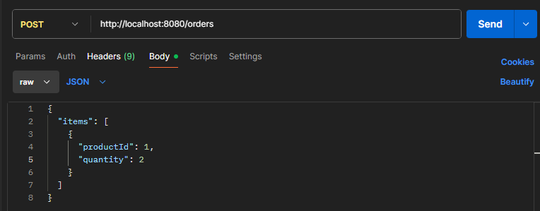
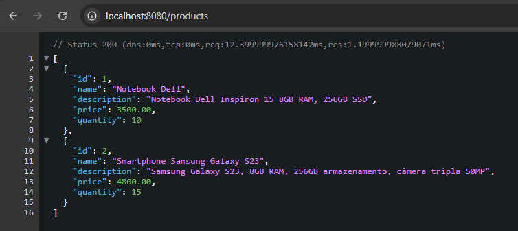
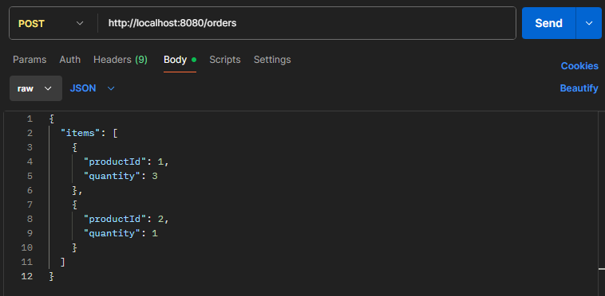
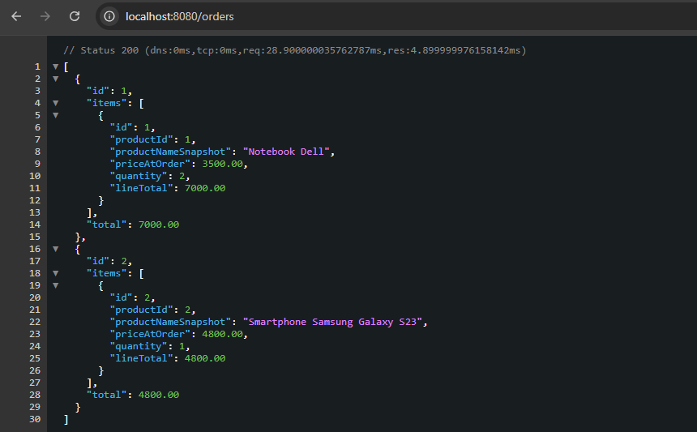

# Desafio NTT Data – Microservices


Sistema de Catálogo e Pedidos desenvolvido como desafio técnico do bootcamp da NTT DATA.  
Ele é composto por vários micro-serviços que se comunicam entre si:

- **Eureka Server** – registro de serviços
- **API Gateway** – ponto de entrada das APIs
- **Service Catalog** – gerenciamento de produtos
- **Service Order** – gerenciamento de pedidos

---

## Índice

- [Visão Geral](#visão-geral)
- [Arquitetura](#arquitetura)
- [Tecnologias Utilizadas](#tecnologias-utilizadas)
- [Pré-requisitos](#pré-requisitos)
- [Execução Local](#execução-local)
- [Endpoints Principais](#endpoints-principais)
- [Estrutura do Repositório](#estrutura-do-repositório)


---

## Visão Geral

Este projeto demonstra a construção de um ecossistema de microservices usando Spring Cloud:

- **Eureka Server** – serviço de descoberta para registrar e localizar instâncias.
- **API Gateway** – atua como roteador centralizado, controlando o acesso aos microservices.
- **Service Catalog** – expõe endpoints para gerenciamento de produtos.
- **Service Order** – consome o catálogo de produtos, valida pedidos e calcula totais.

---

## Arquitetura

```text
[Client] → [API Gateway] → {Eureka Server registra todos os serviços}
                             ↳ [Service Catalog]
                             ↳ [Service Order] → consulta [Service Catalog]
```
## Tecnologias Utilizadas

- Java 21
- Spring Boot, Spring Cloud (Netflix Eureka, Gateway, Discovery)
- Spring Data JPA
- RestTemplate
- Lombok
- H2 (banco em memória, conforme configuração)
- JUnit + Mockito para testes

---

## Pré-requisitos

- Java JDK 21
- Maven ou Gradle
- Configuração de rede local: ajustar IP e CORS conforme necessidade

---

## Execução Local

### 1. Clone o repositório:
   ```bash
   git clone https://github.com/leolsm12/Desafio-NTTData-microservices.git
  ```
     
### 2. Navegue até odiretório do projeto:
   
   ```bash 
      cd Desafio-NTTData-microservices
   ```
### 3. Inicie cada serviço em terminais separados:
   Terminal 1: Eureka Server
   ```bash
    mvn -f eureka-server spring-boot:run
   ```
   Terminal 2: API Gateway
   ```bash
    mvn -f api-gateway spring-boot:run
   ```
   Terminal 3: Service Catalog
   ```bash
   
    mvn -f service-catalog spring-boot:run
   ```
   Terminal 4: Service Order
   ```bash
    
    mvn -f service-order spring-boot:run -Dspring-boot.run.profiles=local
  ```

## Endpoints Principais
| Serviço         | Método | Endpoint                   | Descrição                      |
|-----------------|--------|----------------------------|--------------------------------|
| API Gateway     | —      | `localhost:<gateway-port>` | Passa requisições para os APIs |
| Service Catalog | POST   | `/products`                | Criar produto                  |
|                 | GET    | `/products`                | Lista produtos                 |
|                 | GET    | `/products/{id}`           | Consulta produto por ID        |
| Service Order   | POST   | `/orders`                  | Criar pedido                   |
|                 | GET    | `/orders`                  | Listar todos pedidos           |
|                 | GET    | `/orders/{id}`             | Consultar pedido específico    |

## Exemplos de requisições
### Criar Produto
   
### Consultar Produtos
   
### Criar Pedido
   

### Consultar Pedidos
   

## Estrutura do Repositório
```text
Desafio-NTTData-microservices/
├── eureka-server/          # Serviço de registro Eureka
├── api-gateway/            # API Gateway
├── service-catalog/        # Serviço de Catálogo
├── service-order/          # Serviço de Pedidos
└── README.md               # Documentação do projeto
```